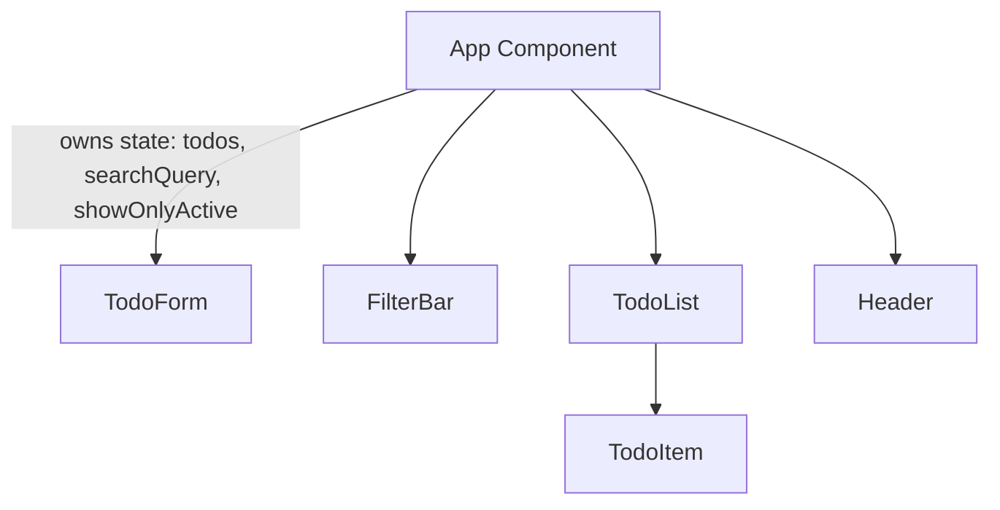

# Component Architecture

## Tree Diagram

### Component Details

1.  **App**
    *   **State**:
        *   `todos`: Array of Todo objects (id, text, completed).
        *   `searchQuery`: String data for filtering todos by text.
        *   `showOnlyActive`: Boolean flag to hide completed tasks.
    *   **Responsibility**: manages the source of truth, handles adding, removing, and toggling todos. Filters the list based on search/active state before passing to children.

2.  **Header**
    *   **Props**: `title`
    *   **Responsibility**: Displays the application title.

3.  **TodoForm**
    *   **Props**: `onAdd(text: string)`
    *   **State**: Local state for input field value.
    *   **Responsibility**: Captures user input and triggers `onAdd` in parent.

4.  **FilterBar**
    *   **Props**:
        *   `searchQuery`: string
        *   `onSearchChange`: function
        *   `showOnlyActive`: boolean
        *   `onToggleFilter`: function
    *   **Responsibility**: Renders search input and "Show only active" checkbox. Controlled components reflecting App state.

5.  **TodoList**
    *   **Props**:
        *   `todos`: Todo[]
        *   `onToggle`: function
        *   `onDelete`: function
    *   **Responsibility**: Renders the list of TodoItems or a specific message if empty.

6.  **TodoItem**
    *   **Props**:
        *   `todo`: Todo object
        *   `onToggle(id)`: function
        *   `onDelete(id)`: function
    *   **Responsibility**: Displays individual todo. Handles click events for toggle/delete.

## Justification for State Management

The main state (`todos`, `searchQuery`, `showOnlyActive`) is placed in the `App` component (Lifted State Up) because:

1.  **Shared Access**: The `todos` list needs to be filtered based on `searchQuery` and `showOnlyActive`. Since the filtering logic resides where the data is (or is passed to), and the controls for filtering (`FilterBar`) are siblings to the list display, the state must live in their common parent (`App`).
2.  **Data Flow**: `TodoForm` adds to `todos`. `TodoItem` modifies `todos` (delete/toggle). Rendered list reads `todos`. Centralizing in `App` makes data flow unidirectional and predictable.
