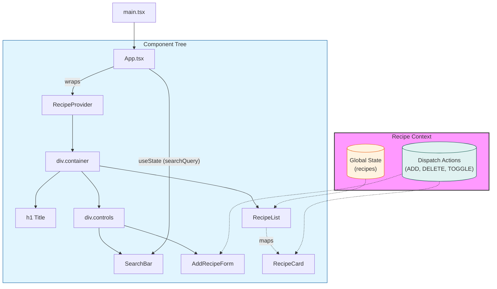

# Struktura Aplikacji Recipe Book

> **Jak zobaczyć grafikę?**
> Otwórz ten plik w VS Code i naciśnij `Ctrl + K`, a następnie `V` (Windows/Linux) lub kliknij ikonę "Open Preview to the Side" w prawym górnym rogu edytora. VS Code wyrenderuje poniższy kod jako diagram.

